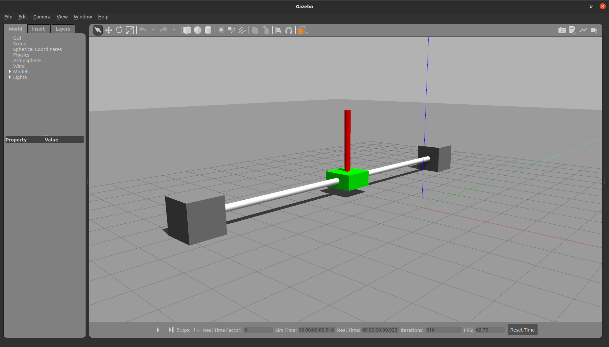

# Cart-Pole simulator using Gazebo
<div align="center">
  
</div>

## Installation
### Requirements
This simulation is based on Gazebo-11 (Classic) and use plugins from `gazebo_ros_pkgs` for interfacing with ROS2. It is assumed that you already have a functioning installation of ROS2.

Installing requirements:
```
$ curl -sSL http://get.gazebosim.org | sh
$ sudo apt install ros-$ROS_DISTRO-gazebo-ros-pkgs
```

### Ruinning
You can clone this repository and build it using colcon build system.

Launching the package:
```
ros2 launch gazebo_polecart_ros polecart.launch.py 
```

## ROS2 Interface
To implement system control, it is useful to use the topics exposed by the simulator:
* `/cart/pole_state` (published): of type `sensor_msgs/msg/JointState`. This message encode the pole angle (in radians). At a value of 0.0 the pole stands upright.
* `/cart/force` (subscribed): of type `geometry_msgs/msg/Wrench`. Publish on this topic imparts a force to the cart that can cause it to move. 

**Example**: 
```
# Impart a force of -10.0N along the y axis to move the cart
$ ros2 topic pub /cart/force geometry_msgs/Wrench '{force: {y: -10.0}}' --once

# Impart a force of 0.0N to stop movement
ros2 topic pub /cart/force geometry_msgs/Wrench '{force: {y: 0.0}}' --once

```

#### NOTES:
* The cart moves back and forth along the **y** axis (positive or negative), forces applied on other axes have no effect.
* Resetting the simulation might be useful before attempting to control the system inorder to start from a standing position:
```
$ ros2 service call /reset_simulation std_srvs/srv/Empty
```
* After a force is imparted using the `Wrench` message, the simulator continues to apply it **even after reset**, so to cancel it, it is essential to impart a force of 0.0

## References
This package is released for teaching and educational purposes only.